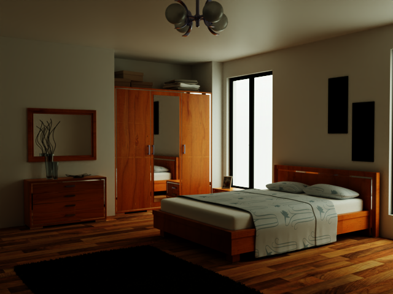
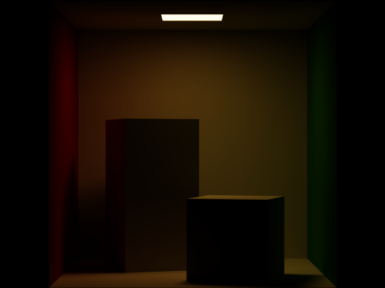

# hala-pathtracer
[](https://www.gnu.org/licenses/gpl-3.0.en.html)
[](https://blog.rust-lang.org/2023/06/01/Rust-1.70.0.html)

[English](README.md) | [中文](README_CN.md) | [日本語](README_JP.md) | [한국어](README_KO.md)

## Introduction
`hala-pathtracer` is a toy-level path tracing renderer developed using `hala-gfx`, which utilizes Vulkan's hardware ray tracing for rendering.
The program is designed to quickly develop and validate ideas about rendering using the efficiency of hardware ray tracing.




## Features
- **Vulkan Ray Tracing**: Utilizes hardware ray tracing acceleration.
- **Light Source Types**:
  - IBL: Uses HDR images in exr file format.
  - Point Light: Specified position.
  - Directional Light: Specified direction.
  - Spotlight: Specified position, direction, and inner/outer angles.
  - Rectangular Area Light: Specified position, direction, width, and height.
  - Spherical Area Light: Specified position and radius.
- **Material Types**
  - Diffuse: When roughness is 0, it's Lambert BRDF; when roughness is greater than 0, it's Oren Nayar BRDF.
  - Disney: Disney BxDF based on GGX.
- **Medium & Volume**
  - Absorb: Absorbs light.
  - Scatter: Scatters light.
  - Emissive: Emits light.
- **File Formats**
  - Scene: [glTF](https://www.khronos.org/gltf/) files with custom extras properties.
  - Image: jpeg, png, pnm, tga, hdr, exr
- **Camera**
  - Perspective Camera: Specified focal length and aperture.
- **Post-Processing**
  - Simple Tonemap
  - Fast ACES
  - Fitted ACES
  - Denoise: Uses [Intel® Open Image Denoise](https://www.openimagedenoise.org/), which requires separate installation.

## TODO List

- [ ] Exposure Compensation
- [ ] Orthographic Camera
- [ ] Multiscatter GGX

## Usage
Build with cargo

```shell
cargo build # or use "cargo build -r" to build the Release version
```

Make sure that you have the Rust programming environment and the cargo package manager installed on your system.

The assets directory in this repository only contains a simple test scene file. More scenes need to be downloaded separately. For more detailed usage, please see the [Usage Documentation](docs/HOW_TO.md).

## Gallery




## Contribution
Contributions of any kind are welcome, whether it's bug reporting or code contributions.

## License
`hala-pathtracer` is open-sourced under the [GNU General Public License v3.0](LICENSE).

## Contact
If you have any questions or suggestions, please contact us by creating an issue.

## References/Credits
- Ray Tracing in One Weekend (https://github.com/petershirley/raytracinginoneweekend), an excellent introductory course on Ray Tracing.
- PBRT-v3 (https://github.com/mmp/pbrt-v3) & PBRT-v4 (https://github.com/mmp/pbrt-v4), authoritative courses on physically based rendering, with free versions of the textbooks available.
- GLSL-PathTracer (https://github.com/knightcrawler25/GLSL-PathTracer), a GPU-accelerated soft PathTracer written using OpenGL and GLSL. This program is largely inspired by this project, and I am especially grateful for the author's generous sharing.