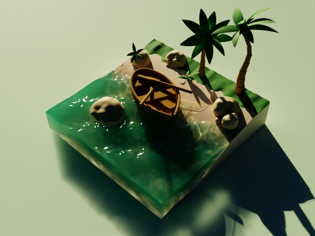

# hala-pathtracer
[](https://www.gnu.org/licenses/gpl-3.0.en.html)
[](https://blog.rust-lang.org/2023/06/01/Rust-1.70.0.html)

[English](README.md) | [中文](README_CN.md) | [日本語](README_JP.md) | [한국어](README_KO.md)

## 简介
`hala-pathtracer`是一个使用`hala-gfx`开发的玩具级路径追踪渲染器，它利用Vulkan的硬件光追进行渲染。
该程序旨在利用硬件光追的高效性快速开发和验证关于任何渲染的想法。


## 功能特点
- **Vulkan Ray Tracing**：使用了硬件光追加速。
- **光源类型**：
  - IBL：使用exr文件格式的HDR图片。
  - 点光：指定位置。
  - 方向光：指定方向。
  - 聚光灯：指定位置、方向和内外角。
  - 矩形面光：指定位置、方向和宽高。
  - 球形面光：指定位置和半径。
- **材质类型**
  - Diffuse：粗造度为0时，为Lambert BRDF；粗造度大于0时，为Oren Nayar BRDF。
  - Disney：基于GGX的Disney BxDF。
- **介质&体积**
  - Absorb：吸收光线
  - Scatter：散射光线
  - Emissive：发出光线
- **文件格式**
  - 场景：带有自定义extras属性的[glTF](https://www.khronos.org/gltf/)文件。
  - 图片：jpeg, png, pnm, tga, hdr, exr
- **相机**
  - 透视相机：指定焦距和光圈。
- **后期**
  - 简单Tonemap
  - 快速ACES
  - Fitted ACES
  - Denoise：使用[Intel® Open Image Denoise](https://www.openimagedenoise.org/)，需要另行安装。

## TODO列表

- [ ] 曝光补偿
- [ ] 正交相机
- [ ] Multiscatter GGX

## 使用
使用cargo构建

```shell
cargo build # 或者使用“cargo build -r”构建Release版本
```

确保你的系统已经安装了Rust编程环境和cargo包管理器。

本仓库assets目录下只包含了一个简单测试场景文件，更多场景需要另行下载，更详细使用请看[使用文档](docs/HOW_TO.md)。

## 画廊




## 贡献
欢迎任何形式的贡献，无论是bug报告或是代码贡献。

## 许可证
`hala-pathtracer`根据《[GNU General Public License v3.0许可证](LICENSE)》开源。

## 联系方式
如果你有任何问题或建议，请通过创建一个issue来联系。

## 参考/受益
- Ray Tracing in One Weekend (https://github.com/petershirley/raytracinginoneweekend), 非常棒的讲述Ray Tracing的入门课程。
- PBRT-v3 (https://github.com/mmp/pbrt-v3) & PBRT-v4 (https://github.com/mmp/pbrt-v4), 基于物理渲染的权威课程，并且有免费版本的电子书。
- GLSL-PathTracer (https://github.com/knightcrawler25/GLSL-PathTracer), 使用OpenGL和GLSL编写的GPU加速软PathTracer。本程序大部分灵感来自于此项目，特别感谢作者的无私分享。