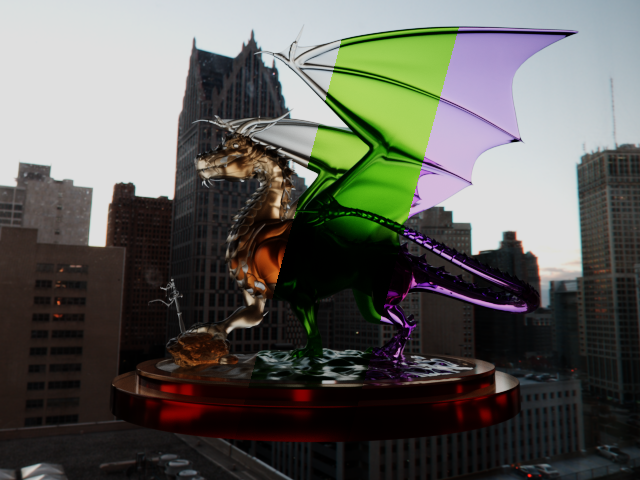
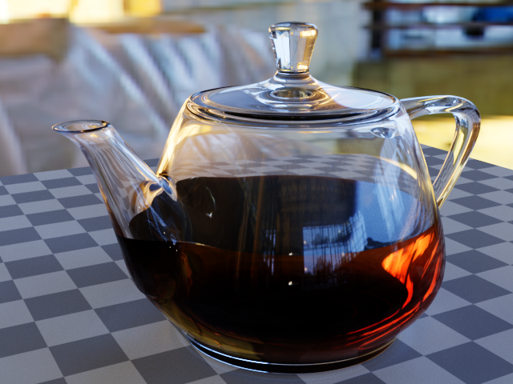

# hala-pathtracer
[](https://www.gnu.org/licenses/gpl-3.0.en.html)
[](https://blog.rust-lang.org/2023/06/01/Rust-1.70.0.html)

[English](README.md) | [中文](README_CN.md) | [日本語](README_JP.md) | [한국어](README_KO.md)

## 紹介
`hala-pathtracer`は`hala-gfx`を使用して開発された玩具レベルのパストレーシングレンダラーで、Vulkanのハードウェアレイトレーシングを利用してレンダリングを行います。
このプログラムは、ハードウェアレイトレーシングの効率を活用して、レンダリングに関するアイデアを迅速に開発し検証することを目的としています。




## 機能特徴
- **Vulkan Ray Tracing**：ハードウェアレイトレーシング加速を使用。
- **光源タイプ**：
  - IBL：exrファイル形式のHDR画像を使用。
  - ポイントライト：指定位置。
  - ディレクショナルライト：指定方向。
  - スポットライト：指定位置、方向、内外角度。
  - 長方形エリアライト：指定位置、方向、幅、高さ。
  - 球形エリアライト：指定位置と半径。
- **材料タイプ**
  - Diffuse：粗さが0の場合はLambert BRDF、粗さが0以上の場合はOren Nayar BRDF。
  - Disney：GGXに基づくDisney BxDF。
- **媒体＆ボリューム**
  - Absorb：光を吸収。
  - Scatter：光を散乱。
  - Emissive：光を放出。
- **ファイル形式**
  - シーン：カスタムextras属性を持つ[glTF](https://www.khronos.org/gltf/)ファイル。
  - 画像：jpeg, png, pnm, tga, hdr, exr
- **カメラ**
  - ペルスペクティブカメラ：焦点距離と絞りを指定。
- **ポストプロセス**
  - シンプルトーンマップ
  - ファストACES
  - フィッテッドACES
  - デノイズ：[Intel® Open Image Denoise](https://www.openimagedenoise.org/)を使用、別途インストールが必要。

## TODOリスト

- [ ] 露出補正
- [ ] オーソグラフィックカメラ
- [ ] Multiscatter GGX

## 使用方法
cargoでビルド

```shell
cargo build # または "cargo build -r" を使用してリリースバージョンをビルド
```

システムにRustプログラミング環境とcargoパッケージマネージャがインストールされていることを確認してください。

このリポジトリのassetsディレクトリには、単純なテストシーンファイルのみが含まれています。より多くのシーンは別途ダウンロードする必要があります。詳細な使用方法については、[使用ドキュメント](docs/HOW_TO.md)をご覧ください。

## ギャラリー




## 貢献
バグ報告やコードの貢献など、あらゆる種類の貢献を歓迎します。

## ライセンス
`hala-pathtracer`は[GNU General Public License v3.0](LICENSE)でオープンソース化されています。

## 連絡先
ご質問や提案がある場合は、issueを作成してご連絡ください。

## 参考文献/クレジット
- Ray Tracing in One Weekend (https://github.com/petershirley/raytracinginoneweekend) 、Ray Tracingに関する素晴らしい入門コースです。
- PBRT-v3 (https://github.com/mmp/pbrt-v3) & PBRT-v4 (https://github.com/mmp/pbrt-v4) 、物理ベースのレンダリングに関する権威あるコースで、無料版の教科書が利用可能です。
- GLSL-PathTracer (https://github.com/knightcrawler25/GLSL-PathTracer) 、OpenGLとGLSLを使用して書かれたGPU加速のソフトPathTracerです。このプログラムは主にこのプロジェクトに触発されており、著者の寛大な共有に特に感謝しています。