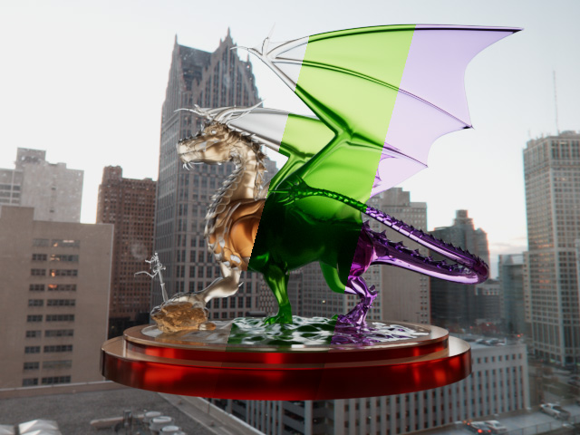
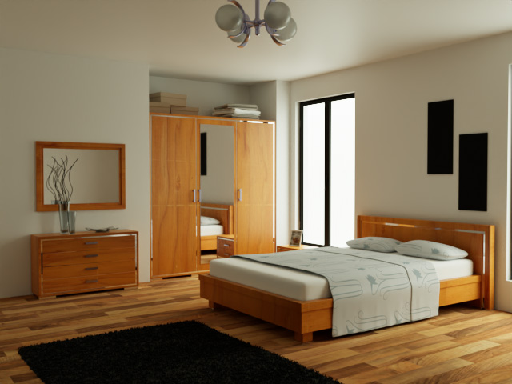
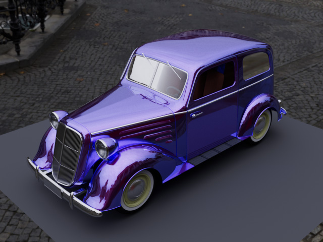
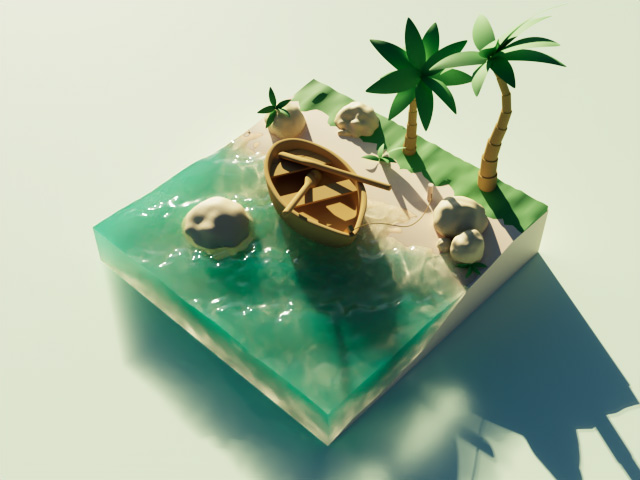
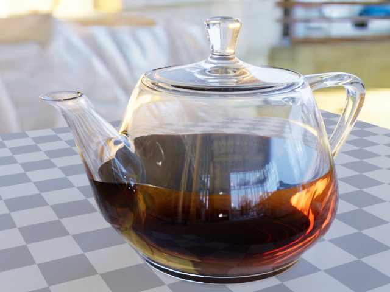
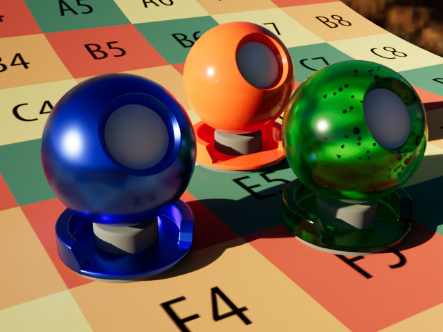
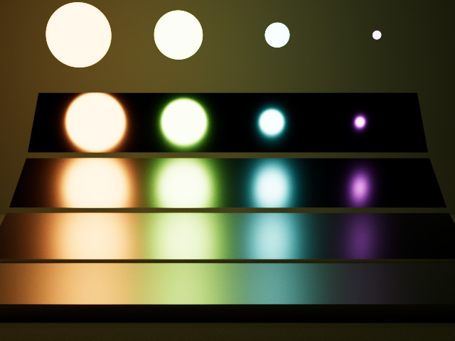
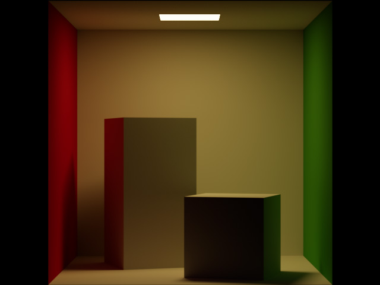

# hala-pathtracer
[](https://www.gnu.org/licenses/gpl-3.0.en.html)
[](https://blog.rust-lang.org/2023/06/01/Rust-1.70.0.html)

[English](README.md) | [中文](README_CN.md) | [日本語](README_JP.md) | [한국어](README_KO.md)

## 소개
`hala-pathtracer`는 `hala-gfx`를 이용하여 개발된 장난감 수준의 경로 추적 렌더러로, Vulkan의 하드웨어 레이 트레이싱을 사용하여 렌더링합니다.
이 프로그램은 하드웨어 레이 트레이싱의 효율성을 활용하여 렌더링에 대한 아이디어를 빠르게 개발하고 검증하기 위해 설계되었습니다.





## 기능 특징
- **Vulkan Ray Tracing**: 하드웨어 레이 트레이싱 가속을 사용합니다.
- **광원 유형**:
  - IBL: exr 파일 형식의 HDR 이미지 사용.
  - 포인트 라이트: 지정된 위치.
  - 방향성 라이트: 지정된 방향.
  - 스포트라이트: 지정된 위치, 방향 및 내부/외부 각도.
  - 사각형 영역 라이트: 지정된 위치, 방향, 너비 및 높이.
  - 구형 영역 라이트: 지정된 위치와 반지름.
- **재질 유형**
  - Diffuse: 거칠기가 0일 때는 Lambert BRDF, 거칠기가 0보다 클 때는 Oren Nayar BRDF.
  - Disney: GGX 기반의 Disney BxDF.
- **매질 & 볼륨**
  - Absorb: 빛을 흡수합니다.
  - Scatter: 빛을 산란합니다.
  - Emissive: 빛을 방출합니다.
- **파일 형식**
  - 장면: 사용자 정의 extras 속성이 있는 [glTF](https://www.khronos.org/gltf/) 파일.
  - 이미지: jpeg, png, pnm, tga, hdr, exr
- **카메라**
  - 퍼스펙티브 카메라: 지정된 초점 거리와 조리개.
- **후처리**
  - 간단한 톤맵
  - 빠른 ACES
  - 피팅 ACES
  - 데노이즈: [Intel® Open Image Denoise](https://www.openimagedenoise.org/)를 사용하며, 별도로 설치해야 합니다.

## 할 일 목록

- [ ] 노출 보정
- [ ] 정사영 카메라
- [ ] Multiscatter GGX

## 사용법
cargo로 빌드

```shell
cargo build # 또는 "cargo build -r"을 사용하여 릴리스 버전을 빌드하세요.
```

시스템에 Rust 프로그래밍 환경과 cargo 패키지 매니저가 설치되어 있는지 확인하세요.

이 저장소의 assets 디렉토리에는 간단한 테스트 씬 파일만 포함되어 있습니다. 더 많은 씬은 별도로 다운로드해야 합니다. 보다 자세한 사용 방법은 [사용 문서](docs/HOW_TO.md)를 참조하세요.

## 갤러리













## 기여
버그 보고 또는 코드 기여 등 모든 종류의 기여를 환영합니다.

## 라이선스
`hala-pathtracer`는 GNU General Public License v3.0을 오픈 소스 라이선스로 사용합니다.

## 연락처
질문이나 제안이 있으시면 issue를 생성하여 연락주십시오.

## 참고문헌/크레딧
- Ray Tracing in One Weekend (https://github.com/petershirley/raytracinginoneweekend), 레이 트레이싱에 대한 훌륭한 입문 과정.
- PBRT-v3 (https://github.com/mmp/pbrt-v3) & PBRT-v4 (https://github.com/mmp/pbrt-v4), 물리 기반 렌더링에 대한 권위 있는 과정으로, 무료 버전의 교재가 제공됩니다.
- GLSL-PathTracer (https://github.com/knightcrawler25/GLSL-PathTracer), OpenGL과 GLSL을 사용하여 작성된 GPU 가속 소프트 PathTracer. 이 프로그램은 주로 이 프로젝트에서 영감을 받았으며, 저자의 너그러운 공유에 특별한 감사를 표합니다.